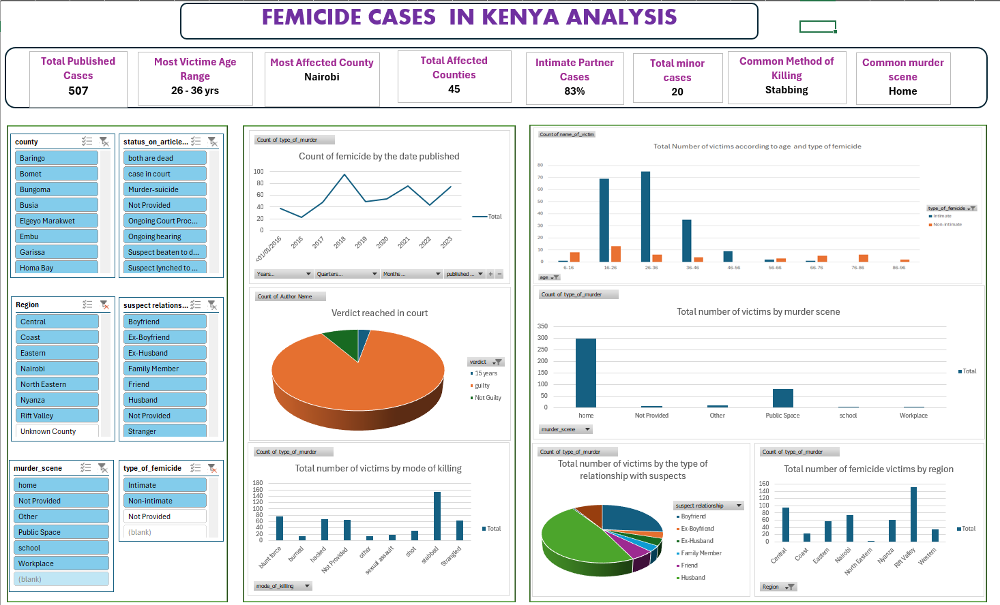

# Femicide Cases in Kenya - Data Analysis (2016-2023)

> A data-driven investigation into femicide patterns across Kenya using Excel Power Query, Pivot Tables, and an interactive dashboard.

---

## Project Overview

Femicide, the killing of women and girls because of their gender, remains one of Kenya's most urgent and underreported crises. This project analyses **507 documented femicide cases** reported across Kenya between **2016 and 2023**, with the goal of surfacing patterns in how, where, and by whom these murders occur.

The analysis was built entirely in **Microsoft Excel**, covering the full data pipeline: ingestion, cleaning, enrichment, visualization, and dashboard.

---

## Data Source

The dataset was downloaded from **[Kaggle](https://www.kaggle.com/)** - *Femicide in Kenya (2016-2023)*.

It was compiled from multiple verified sources including:
- News articles and investigative journalism
- Activist platforms and gender-based violence tracking networks
- Social media reports and community alerts

Each row in the dataset represents a **unique reported femicide case**, with metadata covering victim details, geography, suspect relationship, method of killing, and case legal status.

| Column | Description |
|---|---|
| `Date` | Date the femicide was reported or occurred |
| `Name of Victim` | Victim's name (where available) |
| `Age` | Age of the victim |
| `County` | Geographic county of the incident |
| `Town / Area` | More specific location |
| `Suspect Relationship` | Relationship between victim and perpetrator |
| `Type of Femicide` | Intimate vs. Non-intimate classification |
| `Mode of Killing` | Method used (e.g., stabbing, strangulation) |
| `Murder Scene` | Where the killing took place |
| `Author / Medium` | Reporting outlet or journalist |
| `Case / Court Status` | Legal outcome, if available |

> **Data Limitations:** Some cases have missing attributes due to underreporting. Media sources are cited, but not all cases entered the legal system. This dataset contains real cases of violence and may be distressing.

---

## Data Cleaning (Power Query - Excel)

The raw data was loaded into **Excel's Power Query Editor** and cleaned systematically before any analysis took place.

### Step 1 - Remove Duplicates
Removed all duplicate rows to ensure each case was counted only once.

### Step 2 - Standardise the Author Name Column
- Applied the **PROPER** function to fix mixed-case author names (e.g., `john doe` to `John Doe`).

### Step 3 - Clean the Medium (Source) Column
- Replaced empty and `null` values with `"Not Provided"`.
- Removed the repetitive `(Kenya)` suffix that was cluttering entries and making filters noisy.

### Step 4 - Standardise Type of Murder
- The column had both `femicide` and `Femicide` as distinct values.
- Replaced all instances of `femicide` with `Femicide` for consistent filtering.

### Step 5 - Clean Name of Victim Column
- Replaced `"unnamed"` entries and empty/null cells with `"Not Provided"`.

### Step 6 - Clean Suspect Relationship Column
- Removed the trailing `"/Unknown relationship"` appended to `Stranger` entries, which was logically redundant.
- Removed the trailing `"/known to the victim"` appended to `Friend` entries, which was also redundant.

### Step 7 - Fill Remaining Nulls
- Replaced all remaining `null` and empty values in text columns across the dataset with `"Not Provided"`.

### Step 8 - Apply PROPER to Key Columns
- Applied the **PROPER** text function to several more columns to eliminate duplicate filter entries caused by inconsistent capitalisation.

---

## Data Enrichment - Region Mapping

After cleaning, a **Region** column was added to group Kenya's 47 counties into their respective administrative regions (Central, Coast, Eastern, Nairobi, North Eastern, Nyanza, Rift Valley, Western).

This was done using an **XLOOKUP** formula referencing a separate mapping table:

```excel
=XLOOKUP(U2, Mapping!$A$2:$A$48, Mapping!$B$2:$B$48, "Unknown County")
```

This step served a dual purpose:
1. **Enabled regional aggregation** for higher-level geographic analysis.
2. **Surfaced county name typos** - any misspelled county returned `"Unknown County"`, which were then corrected in the source data.

---

## Analysis and Dashboard

With clean, enriched data, Pivot Tables and Charts were built to answer key questions, then assembled into a single **interactive Excel dashboard**.



### KPIs at a Glance

| KPI | Value |
|---|---|
| Total Published Cases | **507** |
| Most Affected County | **Nairobi** |
| Total Affected Counties | **45** |
| Intimate Partner Cases | **83%** |
| Most Vulnerable Age Range | **26-36 yrs** |
| Total Minor Victims | **20** |
| Most Common Method of Killing | **Stabbing** |
| Most Common Murder Scene | **Home** |

### Dashboard Visuals

The dashboard includes the following charts:

- **Line chart** - Count of femicide cases by year (2016-2023)
- **Pie chart** - Court verdict breakdown (Guilty / Not Guilty / 15 years / Ongoing)
- **Bar chart** - Total victims by mode of killing
- **Bar chart** - Total victims by murder scene
- **Pie chart** - Victim breakdown by suspect relationship
- **Bar chart** - Total femicide victims by region
- **Clustered bar** - Victims by age group and type of femicide (Intimate vs. Non-intimate)
- **Slicers** - County, Region, Murder Scene, Type of Femicide, Suspect Relationship, Case Status

---

## Key Insights

### 1. Incident Trends Over Time
Cases showed significant variation year over year between 2016 and 2023, with visible spikes in the trend line. The volume of reported cases highlights that this is not an isolated issue but a sustained, ongoing crisis.

### 2. The Home Is the Most Dangerous Place
The overwhelming majority of femicide cases occurred **at home**, followed by public spaces. This directly challenges the assumption that women are safer indoors - the data shows the opposite is true.

### 3. Intimate Partners Are the Primary Perpetrators
**83% of femicide cases** were committed by intimate partners - boyfriends, husbands, or ex-partners. This makes intimate partner violence the single biggest driver of femicide in Kenya.

### 4. Most Victims Are Women Aged 26-36
The most targeted demographic is women in the prime of their adult lives. Twenty minor victims were also recorded, underscoring that no age group is immune.

### 5. Stabbing and Strangulation Are the Dominant Methods
The most common modes of killing were **stabbing** and **strangulation**, indicating up-close, personal violence rather than opportunistic or distance-based crime.

### 6. Nairobi Leads, But the Crisis Is Nationwide
Nairobi recorded the highest number of cases, but **45 out of 47 counties** were affected - this is a national crisis, not an urban phenomenon.

### 7. Chilling Motives on Record
Several documented cases revealed mundane triggers for murder, including **arguments over food**, a sobering reminder of how deeply entrenched and disproportionate gender-based violence can be.

### 8. Court Outcomes Are Rare
The verdict breakdown shows that a large proportion of cases never reached a guilty verdict, pointing to significant gaps in how the justice system responds to femicide.

---

## Repository Contents

| File | Description |
|---|---|
| `femicide_dirty_data.xlsx` | The original raw dataset as downloaded from Kaggle |
| `cleaned_kenyan_femicide_data.xlsx` | The fully cleaned, enriched dataset with Pivot Tables and Dashboard |
| `dashboard.png` | Screenshot of the final interactive Excel dashboard |
| `readme.md` | This file |

---

## Tools Used

| Tool | Purpose |
|---|---|
| Microsoft Excel - Power Query | Data ingestion, transformation, and cleaning |
| Excel XLOOKUP | Data enrichment and county-to-region mapping |
| Excel Pivot Tables | Aggregation and cross-tabulation |
| Excel Charts and Dashboard | Visualization and insight communication |

---

## Purpose and Impact

This analysis was built to contribute to the public discourse on femicide in Kenya. The numbers behind each data point represent a real life lost. By making this data structured, visual, and accessible, the aim is to support:

- **Researchers and public health analysts** studying gender-based violence trends
- **Journalists and advocates** building evidence-based narratives
- **Policymakers** identifying high-risk regions and demographics for intervention
- **Awareness campaigns** that use data to drive systemic change

---

## License and Attribution

Dataset sourced from Kaggle - *Femicide in Kenya (2016-2023)*. Curated from public reports, news media, and gender-based violence tracking platforms in Kenya. All individual case data is handled with sensitivity and respect for the victims and their families.